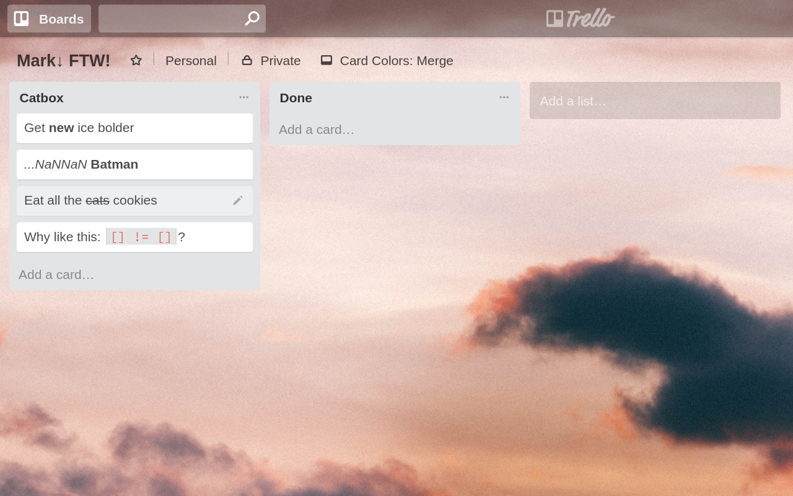

# Trello card title Markdown (Chrome extension)
Add basic support for Markdown in Trello card titles: **bold**, *emphasized*, `code` & ~~strikethrough~~. Looks like this:


[Get it from the Chrome Web Store](https://chrome.google.com/webstore/detail/nahpelodohninpblkcldjdohdhiahdef)

## Other browsers
Perhaps the "raw" [userscript](https://gist.github.com/gorbiz/6062481) might do it.

## Build
```sh
./build # create a `.zip` to be uploaded to the Chrome Web Store
```
